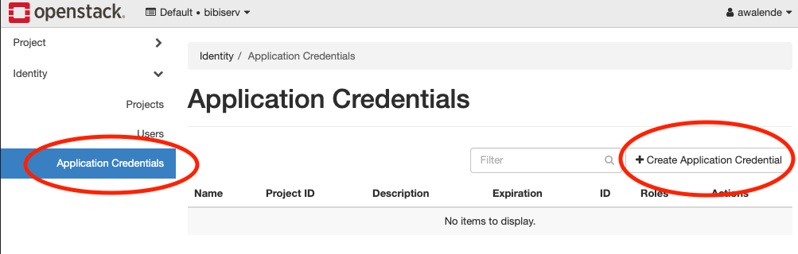

# Data Management in the de.NBI cloud

This assumes that you are familiar with the de.NBI cloud platform and have setup your account and ssh keys.
We also assume that you are familiar with basic operations such as launching VMs, setting and containers.

## Section 1: Create a new VM

First, we will start out by creating a new VM via the SimpleVM webportal (https://simplevm.denbi.de/portal/webapp). Select "Create new Instance" and choose the "CLUMrdm20251" project, with "de.NBI small" flavor and Guacamole as your research environment. We will also install some additional Conda Packages. We will install parallel (version 20250822), sra-tools (version 3.2.1) and minio-client (version 2025.08.13.08.35.41) conda packages.

Next, grant access to the workshop organizers (**Sebastian Jünemann** and **Abhijeet Shah**). This way these memebers get ssh access to your VM in case something does not work as expected. 

Once the VM is built and spooled up (it may take upto 10 minutes), you can connect to it via SSH or Guacamole. Launch a terminal (if you use Guacamole), and fetch the latest information about available packages and updates. Following this, we will also install a few packages.

```bash
sudo apt update
sudo apt upgrade
sudo apt install python3-openstackclient
```
## Section 2: Create a volume to store data

1. Inspect what block storage is available on your virtual instance by typing:

   ``` bash
   df -h 
   ```

2. Check the current disk usage and available space.

3. In the SimpleVM portal, navigate to the Volumes section and create a volume for your VM.
   Enter your name without whitespace (Example: Max Mustermann -> MaxMusterman) as the volume name 
   and provide 10 GB as the volume size.
   

4. Attach this volume to your instance by opening the pull down menu of your volume and
   clicking the green attach icon. Then select your virtual machine in the pop up menu and
   click the attach button.
   

5. Activate the newly created and attached volume in your VM:

   ``` bash
   lsblk
   sudo mkfs.ext4 /dev/vdc
   sudo mkdir /mnt/volume   
   sudo mount /dev/vdc /mnt/volume
   sudo chown ubuntu:ubuntu /mnt/volume
   lsblk   
   ```
 


## Section 3: Using Object Storage

In this section, we will the openstack horizon interface directly.
First we need to setup and configure our credentials on our virtual machine.
Please navigate to the following site:

<https://openstack.cebitec.uni-bielefeld.de/project/>

1. Creating application credentials

In this section you will create an [application
credential](https://docs.redhat.com/en/documentation/red_hat_openstack_platform/14/html/users_and_identity_management_guide/application_credentials)
and download the autocp  .
mc cp sra/ftp.era.ebi.ac.uk/vol1/fastq/SRR398/008/SRR3984908/SRR3984908_2.fastq.gz .generated `clouds.yaml`. `clouds.yaml` contains all
required authentication information. Follow the images:



Don't use the input field secret. As you can see its input is not
hidden. OpenStack will generate a strong secret for you, if you leave it
blank. You should pick a sensible expiration date.


We will now save the downloaded `clouds.yaml` under
`~/.config/openstack/`. That will allow the `OpenstackClient` to access
it. You will also need the `app-cred-openrc.sh` script finish the setup.


If the file was auto downloaded, you need to move it instead:

``` bash
mkdir -p ~/.config/openstack
mv ~/Downloads/clouds.yaml ~/.config/openstack/
mv ~/Downloads/app-cred*.sh ~/.config/openstack/
chmod 600 ~/.config/openstack/clouds.yaml
chmod 600 ~/.config/openstack/app-cred*.sh
source ~/.config/openstack/app-cred*.sh
```

If you have `OpenstackClient` installed and `openstack subnet list` runs
without error, you are ready to proceed.

``` bash
openstack project list
openstack prject show clumRDM251
```

2. Creating S3 credentials

The creation of credentials for the project related object storage can't
be done in the web interface. Therefore, we will use the openstack CLI
for that.

``` bash
openstack --os-identity-api-version 3 ec2 credentials create
```

This command will return you the newly generated key and secret. You
can, at any time, look up what S3 credentials are still valid for you
using

``` bash
openstack --os-identity-api-version 3 ec2 credentials list
```

We will now configure the S3 minio client:

``` bash
mc alias set clumRDM251 https://openstack.cebitec.uni-bielefeld.de:8080/ <YOUR-ACCESS-KEY> <YOUR-SECRET-KEY>
```

3. Uploading data to the Object Storage

We will now use the minio client to upload some data. In the guacamole
SimpleVM instance, type:

``` bash
cd /mnt/volume
```

We will download some more data to play around with:
**Attention**: You will download a large file (approx 14 GiB)

``` bash
mc cp --recursive aws/sra-pub-run-odp/sra/ERR14244221 ./
```

4. Using a object storage container
Next, we are going to create a new object storage container, a so called
bucket. For this, we will use for the first time the horizon interface.
Navigate to the **Container** entry under the **Object Store** menu
entry. Note: All containers here are visible to all project members, as
those containers in openstack are bound to the project

This container is empty, but we can show it nevertheless on the command
line using the minio client:

``` bash
mc ls clumRDM251
```

This should show you your previously created bucket (container) name
(next to all others). You can now upload data into it.

``` bash
mc cp *.fastq.gz clumRDM251/YOUR_CONTAINER_NAME
mc ls clumRDM251/YOUR_CONTAINER_NAME
```

Tip: You can enable auto completion for the minio client. After
activiation, the shell needs to be restarted, though.

``` bash
mc --autocompletion
```
